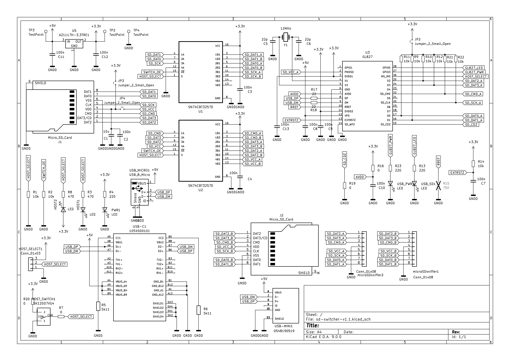

# SD Card Switcher

A simple hardware device for switching a microSD card between a PC and another SD-card host device. 

  
  

## Use Cases

Useful for devices where an SD card needs to be frequently accessed from both the target device and a PC, for example:

- Firmware development and testing
- Embedded Linux development
- 3D printers
- Single-board computers
- SD-card based embedded devices
- Easy access to logs and configuration files

The switch changes the physical connection of the SD card; it does not copy or synchronize data.

## How it works

The device contains:

* USB interface for connecting the card to a PC
* microSD card slot
* SD-card-shaped PCB with an SD edge connector
* Hardware switch for selecting the active connection

Insert a microSD card into the onboard slot and plug the SD-shaped PCB into the target device.

The switch selects whether the microSD card is connected to:

* **PC** via USB
* **Target device** via the SD card interface

This allows the same SD card to be easily switched between a computer and the target device without physically removing the card.

## Main Components

| Component              | Part                     |
| ---------------------- | ------------------------ |
| USB/SD card controller | GL827                    |
| Bus switch             | SN74CBT3257D             |
| SD card socket         | 693072010801             |
| USB-C connector        | Molex 105450-0101        |
| Micro USB connector    | Molex 54819-0519         |
| Switch                 | SPDT switch              |
| LED                    | LED                      |
| Passives               | Resistors and capacitors |

## Schematic

## PCB

**PCB thickness: 0.8 mm**

The SD-shaped PCB edge connector requires a 0.8 mm PCB thickness to fit properly into a standard SD card slot.

The PCB was manufactured by [JLCPCB](https://jlcpcb.com/?from=GRVYI). This is a referral link. 

## Files

This repository contains the PCB design files and manufacturing files required to build the SD Card Switcher.

## Disclaimer

This project is provided "as is", without any warranty.

The author is not responsible for any damage to SD cards, connected devices, computers, or other hardware resulting from the use, modification, or construction of this project.

Build and use it at your own risk.

## License

Open-source hardware project.
